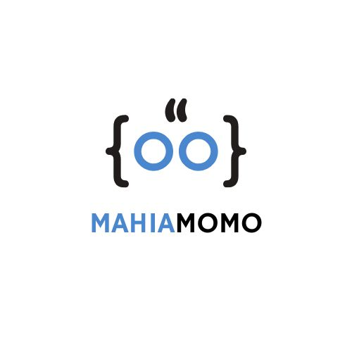

<h1 align="center">Mahia Akter Momo — Portfolio</h1>

<p align="center">
  
</p>

<p align="center">
  <em>A personal portfolio website for showcasing experience, skills, projects, and creative work.</em>
</p>

<p>
  <a href="https://astro.build/">
    
  </a>
  <a href="https://www.typescriptlang.org/">
    
  </a>
  <a href="https://vercel.com/">
    
  </a>
</p>

## ✨ Overview

This portfolio is designed as a clean, responsive, and easy-to-maintain personal website. It includes dedicated pages for:

- A short introduction and profile
- Work experience
- Skills and technical strengths
- Selected projects and project details
- Posts or additional work

The visual direction is inspired by [craftzdog's homepage](https://www.craftz.dog/), with a personal design and content structure tailored for Mahia Akter Momo.

## 🔗 Live Website

Visit the deployed portfolio:

**[mahiamomo-portfolio.vercel.app](https://mahiamomo-portfolio.vercel.app)**

## 🛠️ Built With

- [Astro](https://astro.build/) — static site framework
- TypeScript — typed profile and project data
- CSS — custom responsive styling
- Vercel — deployment and hosting

## 📁 Project Structure

```text
portfolio/
├── public/                 # Static assets such as images and icons
├── src/
│   ├── components/         # Reusable UI components
│   ├── data/
│   │   └── profile.ts      # Main profile, experience, skill, and project data
│   ├── layouts/            # Shared page layouts
│   ├── pages/              # Website routes
│   │   ├── index.astro     # Home page
│   │   ├── experience.astro
│   │   ├── skills.astro
│   │   ├── works.astro
│   │   ├── works/[slug].astro
│   │   └── posts.astro
│   └── styles/             # Global styles
├── astro.config.mjs
├── package.json
└── package-lock.json
```

## 🚀 Getting Started

### Prerequisites

- [Node.js](https://nodejs.org/) 18 or newer
- npm

### Installation

Open a terminal in the `portfolio` directory and run:

```bash
npm install
```

### Start the development server

```bash
npm run dev
```

The website will be available at:

```text
http://localhost:4321
```

### Create a production build

```bash
npm run build
```

The production files are generated in the `dist/` directory.

### Preview the production build

```bash
npm run preview
```

## ✏️ Updating Content

Most portfolio content is managed in one place:

```text
src/data/profile.ts
```

Update this file to change the:

- Name and biography
- Social links
- Work experience
- Competitions and achievements
- Skills
- Projects and project descriptions

### Profile photo

Add a profile image at:

```text
public/avatar.jpg
```

If no image is available, the site displays the profile initials instead.

### Project images

Keep project images and other static assets inside `public/`, then reference them from the project data. For example:

```text
public/project-preview.jpg
```

## ☁️ Deployment

### Deploy with Vercel

1. Push the project to GitHub.
2. Open [Vercel](https://vercel.com/) and select **Add New Project**.
3. Import the GitHub repository.
4. Select **Astro** if Vercel does not detect it automatically.
5. Use the default build command:

   ```bash
   npm run build
   ```

6. Deploy the project.

The site URL is configured in [`astro.config.mjs`](./astro.config.mjs).

## 📜 Available Scripts

| Command | Description |
| --- | --- |
| `npm install` | Install project dependencies |
| `npm run dev` | Start the local development server |
| `npm run build` | Build the production website |
| `npm run preview` | Preview the production build locally |


The portfolio keeps the required attribution link in the footer. The original 3D voxel dog artwork is not included in this project.

## 📄 License

This portfolio is a personal project. Please contact the author before reusing its content, personal information, or artwork.
